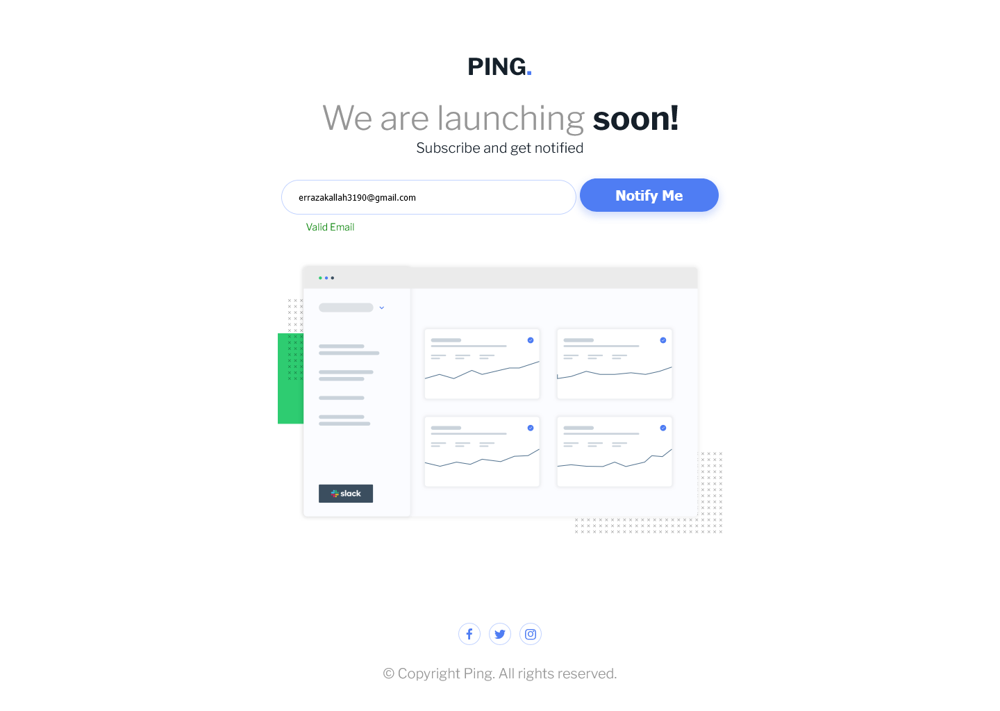
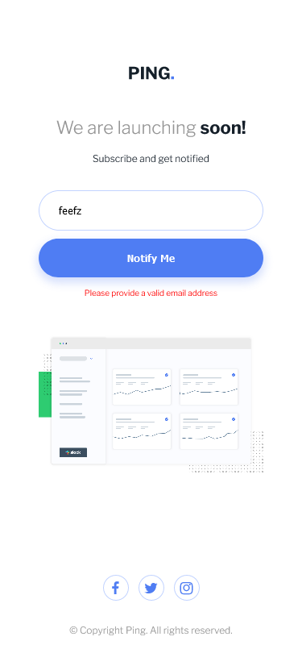
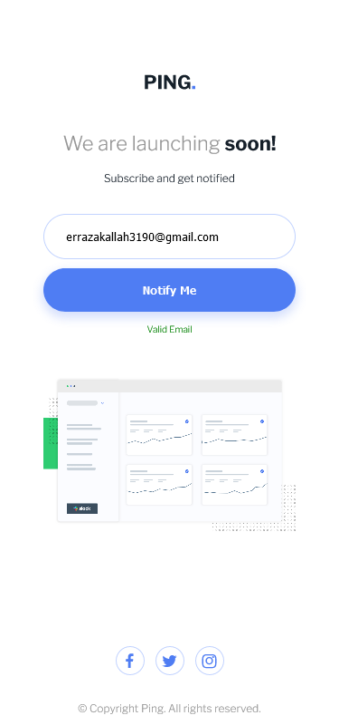
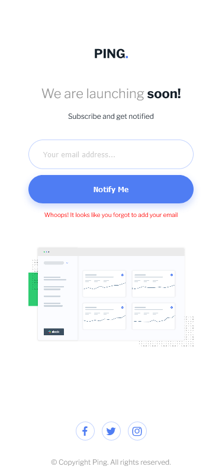

# Frontend - Ping-coming-soon-page

<!-- Summary -->

This is a solution to the [Ping coming soon page challenge on Frontend Mentor](https://www.frontendmentor.io/challenges/ping-single-column-coming-soon-page-5cadd051fec04111f7b848da). Frontend Mentor challenges help you improve your coding skills by building realistic projects.

## Table of contents

- [Overview](#overview)
  - [The challenge](#the-challenge)
  - [Screenshot](#screenshot)
  - [Links](#links)
- [My process](#my-process)
  - [Built with](#built-with)
  - [What I learned](#what-i-learned)
- [Author](#author)

## Overview

### The challenge

Users should be able to:

- View the optimal layout for the site depending on their device's screen size
- See hover states for all interactive elements on the page
- Submit their email address using an `input` field
- Receive an error message when the `form` is submitted if:
  - The `input` field is empty. The message for this error should say _"Whoops! It looks like you forgot to add your email"_
  - The email address is not formatted correctly (i.e. a correct email address should have this structure: `name@host.tld`). The message for this error should say _"Please provide a valid email address"_

### Screenshot

### Links

Live Site URL: [Live Site URL:](https://tender-brattain-013d9d.netlify.app/)

## My process

- Build first mobile design
- build desktop design + make it responsive
- add functions to check inputs

### Built with

<!-- Info -->

- Mobile-first workflow
- JavaScript + DOM
- Semantic HTML5 markup
- CSS custom properties

### What I learned

- Pay attention for the scopes and var declarations
- reminder that when u target an input field u target that field.value
  `const email = document.getElementById("email").value;`
- regEx are really very useful more than I thought, like the one to check the email format
- I learn about the `preventDefault()`, it is really useful to use it with input to prevent sending data if data wasn't correct

## Author

<!-- - Website -  -->

- Frontend Mentor - [@Rezzak](https://www.frontendmentor.io/profile/Rezzak48)
- Twitter - [@Rezzak_48](https://twitter.com/Rezzak_48)
